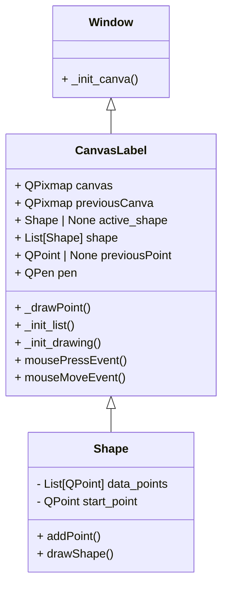

# Illustrator Clone

A simple PyQt6 drawing app that lets you create freeform polygon-like shapes on a white canvas.

## Features

- Draw on an 800x800 canvas.
- Create a shape point by point with mouse clicks.
- See a live preview line while moving the mouse.
- Close a shape by clicking near its starting point.
- If a shape has fewer than 3 points, it is rendered as a polyline.

## Project Structure

- `gui.py`: Application entry point and main window.
- `canva.py`: Canvas widget (`CanvasLabel`) and mouse interaction logic.
- `shape.py`: `Shape` model and final rendering logic.

## Architecture

This project follows a small UI-driven architecture: `gui.py` bootstraps the Qt application and hosts the main window, `CanvasLabel` in `canva.py` handles user interaction and drawing state, and `Shape` in `shape.py` encapsulates geometry data and rendering behavior. Mouse events flow from the window into the canvas widget, which updates the active shape and delegates final shape rendering to the `Shape` object.

Mermaid class diagram placeholder:



## Requirements

- Python 3.10+ (tested with Python 3.13)
- `PyQt6`
- `numpy`

## Installation

From the `illustrator-clone` folder:

```bash
pip install PyQt6 numpy
```

## Run

```bash
python gui.py
```

## How to Use

1. Click once on the canvas to start a new shape.
2. Move the mouse to preview the next segment.
3. Click to add more points.
4. Click near the first point (within ~10 px) to close and finish the shape.
5. Click elsewhere to start another shape.

## Notes

- The current implementation uses one pen style (round cap, width 6).
- There is no undo/redo or save/export yet.
- The file is named `canva.py` in this project (not `canvas.py`).